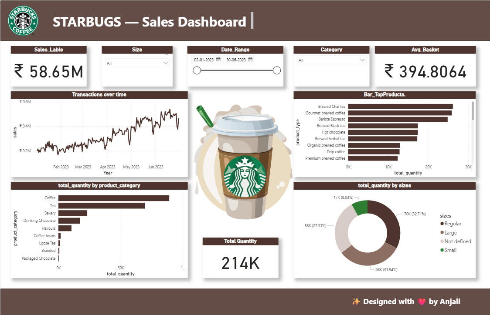

# 🌟 StarBugs Power BI Dashboard

An interactive Power BI dashboard analyzing **StarBugs sales & performance data**.  
This dashboard provides insights into sales trends, customer distribution, and performance KPIs.  

---

## 📸 Preview

---

## 📂 Repository Contents
- **StarBugs_Dashboard.pbix** → Main Power BI file  
- **Dashboard_ss** → Screenshot of dashboard page 

---

## 🧰 How to Use
1. Download the `.pbix` file.  
2. Open it with **Power BI Desktop (latest version)**.  
3. Refresh data connections (if needed).  

---

## 📝 Notes
- Built using **Power BI Desktop**.  
- Data shown is for **educational/demo purposes**.  
- Sensitive company data has been removed.  

---

## 👩‍💻 Author
Designed & Developed by **Anjali Anil Jaisinghani** ✨

